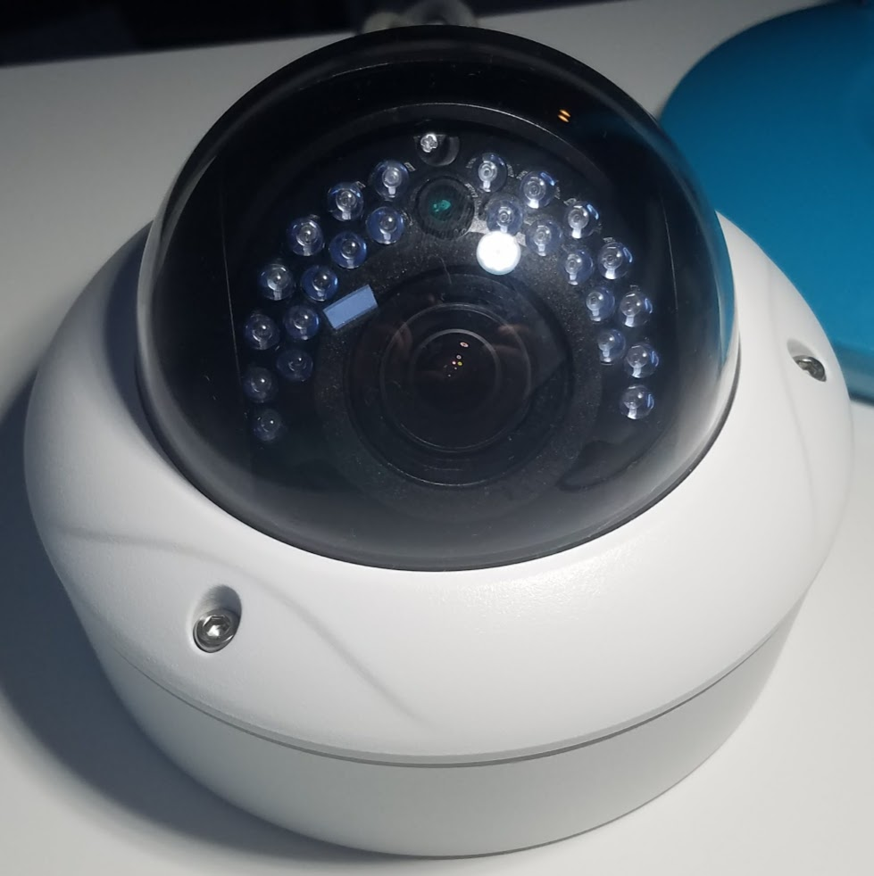
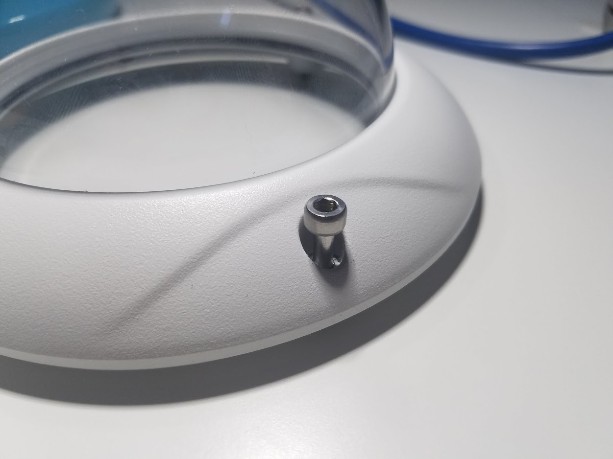
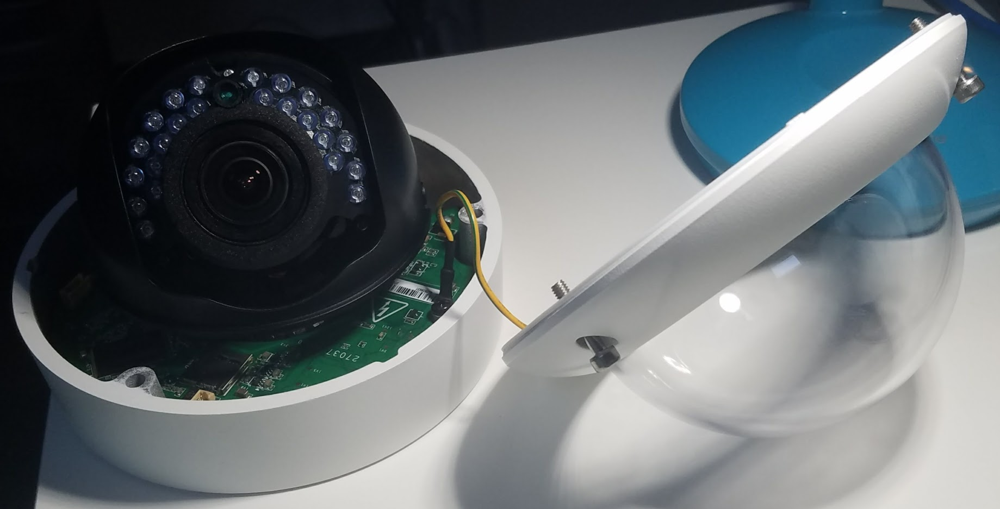
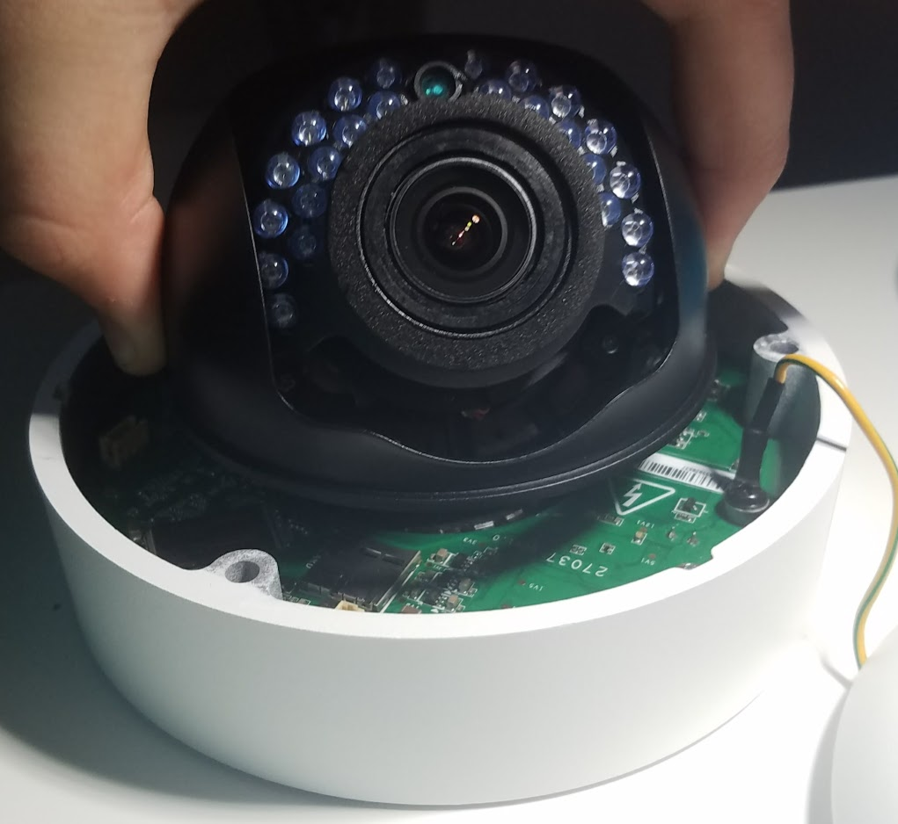

# Luma Camera Documentation

## Specifications:

**Model Number:** LUM-700-DOM-IPH-WH

**Resolution:**

| Resolution | Max FPS |
|------------|---------|
| 2688x1520  | 20      |
| 1920x1080  | 30      |
| 1280x720   | 30      |

**Power:** IEEE 802.11af POE (48V)

**SD Card Slot:** Up to 128GB

## Resetting the Camera:
Before using the camera with a custom NVR, you will need to reset it to the factory defaults.

### Tools Needed:
* Hex 3.0 Bit
* Phillips Head 2.0 Bit

### Step 1: Remove Outer Casing Screws

### Step 2: Remove Plastic Lens Assembly Cover

### Step 3: Locate, Then Press and Hold Reset Button for 15 Seconds.

## Setting Up a DHCP Server:

To configure the camera, you have to set up a DHCP server so it can get an IP. The range it uses is `192.168.123.0-192.168.123.254`. Your computer should be configured with a static IP of `192.168.123.1` and the router configured with a static IP of `192.168.123.2`.

**Subnet:** `192.168.123.0/24`

**Start Address:** `192.168.123.3`

**End Address:** `192.168.123.254`

**Router:** `192.168.123.2`

**DNS:** Personal Preference. I use `8.8.8.8` and `8.8.4.4`

**Workstation IP:** `192.168.123.1`

## Powering the Camera:

The Luma LUM-700-DOM-IPH-WH uses the IEEE 802.11af POE standard. Any switch or POE injector that supports this and the wattage/voltage the camera supports should be able to power it via POE.
